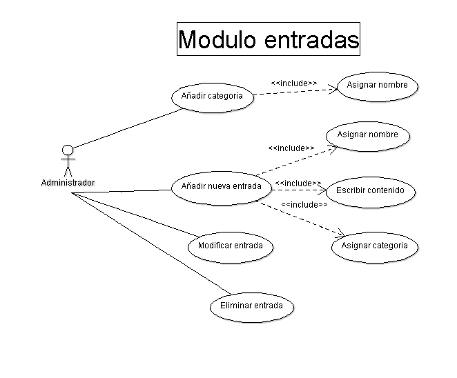
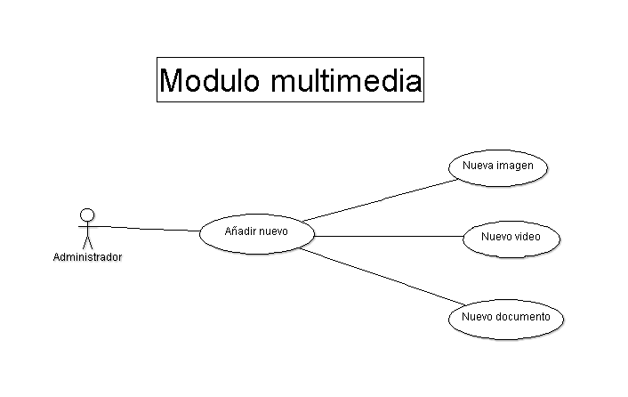
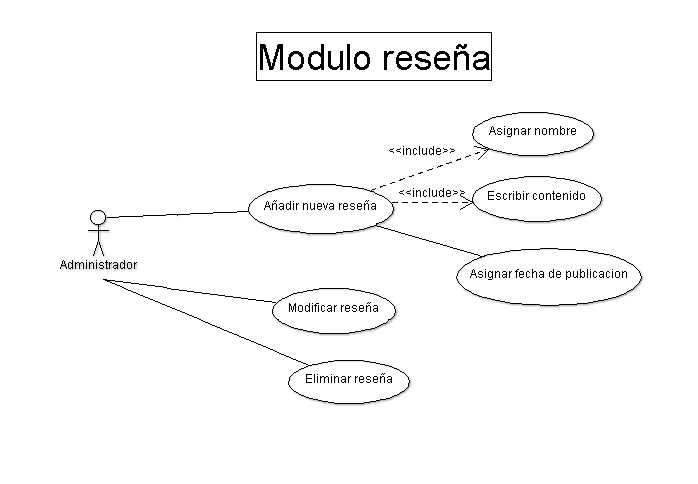
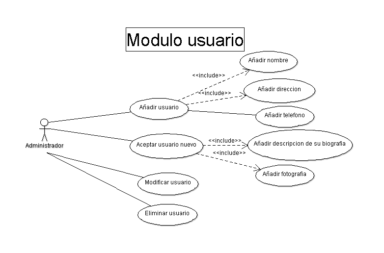
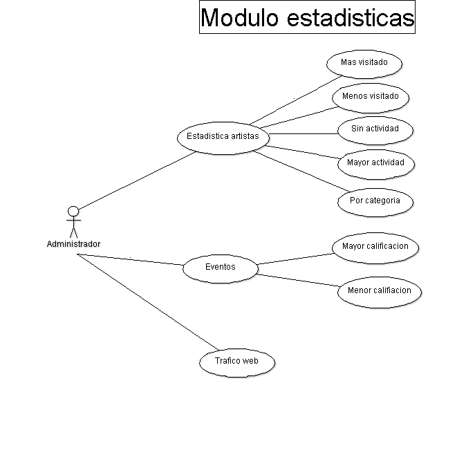
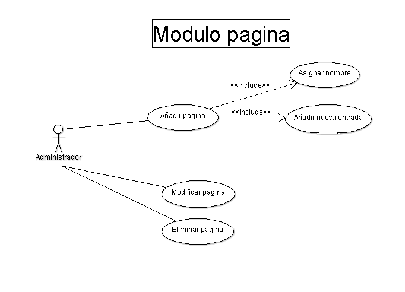
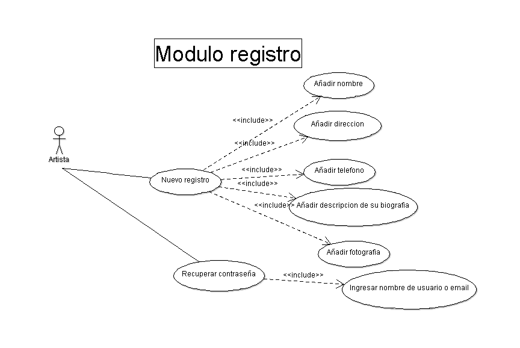
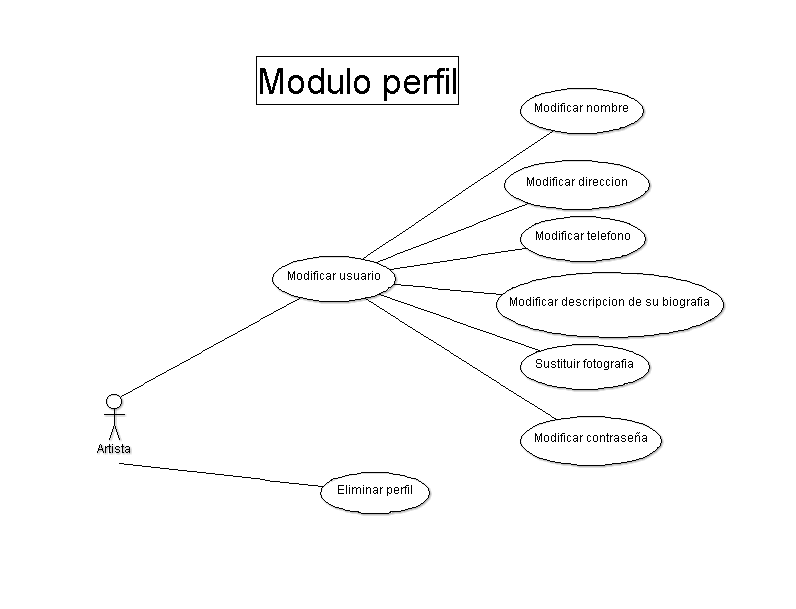
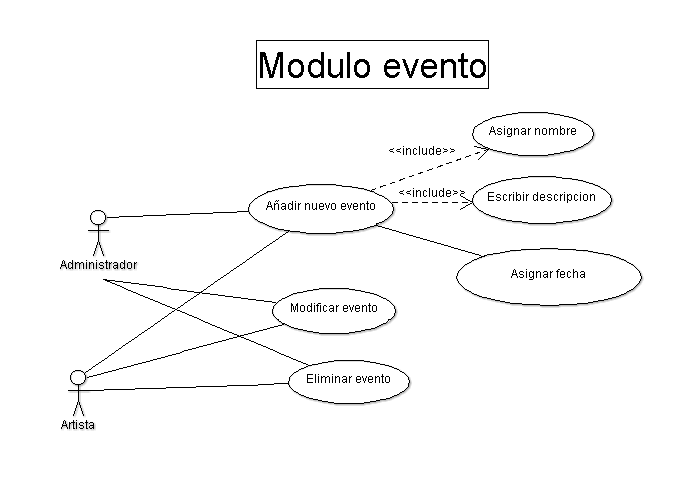

**Diseño de la aplicacíon**
****************************

**CASOS DE USO**
==================
**Administrador**
-----------------

**Caso de uso MODULO ENTRADA**
-------------------------------
- Este modulo las entradas es un tipo de contenido, en donde se pueden agregar fotografias, videos, documentos. Para que funcione tiene que tener asignada una categoria para poder ser asignada a una pagina.

**Caso de uso MODULO MULTIMEDIA**
-------------------------------
- En este modulo servira subir al servidor y guardar las imagenes, videos, archivos, documentos. Estas archivos se guardaran en las carpetas especificas.

**Caso de uso MODULO RESENIA**
-------------------------------
- En este modulo el administrador tendra 250 caracteres para colocar la descripcion de hechos que quiera que el usuario visitante vea sobre los acontecimientos historicos.

**Caso de uso MODULO USUARIO**
-------------------------------
- El administrador podra ingresar a cualquier usuario o artista que quiera ser registrado en la web. Ademas aqui es donde podran ser aceptados los nuevos usuarios registrados

**Caso de uso MODULO ESTADISTICAS**
-----------------------------------
- Aqui el administrador podra filtrar las estadisticas segun sean requeridas

**Caso de uso MODULO PAGINAS**
-------------------------------
- Este modulo sirve para crear paginas nuevas (Secciones) en las cuales se puede asignar las entradas creadas para introducir contendo nuevo.

**Artista**
-----------

**Caso de uso MODULO REGISTRO**
-------------------------------
- En este modulo el usuario subira su informacion para crear su perfil y ser aceptada por el administrador.

**Caso de uso MODULO PERFIL**
-------------------------------
- Este modulo se utiliza cuando el artista quiere modificar su informacion o eliminar su perfil.

**Caso de uso MODULO EVENTOS**
-------------------------------
- En este modulo se crearan los nuevos eventos para ser publicados en el contenido web

Clases
======
Diagramas de clases y de sus distintas actividades, si fuese necesario.

Diagrama de BD
--------------

Diagrama de la Base de Datos que requerirá el software.
