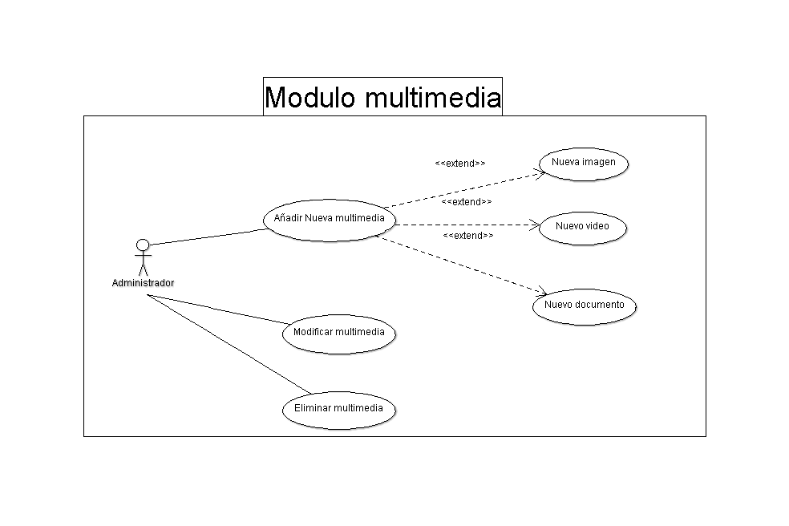
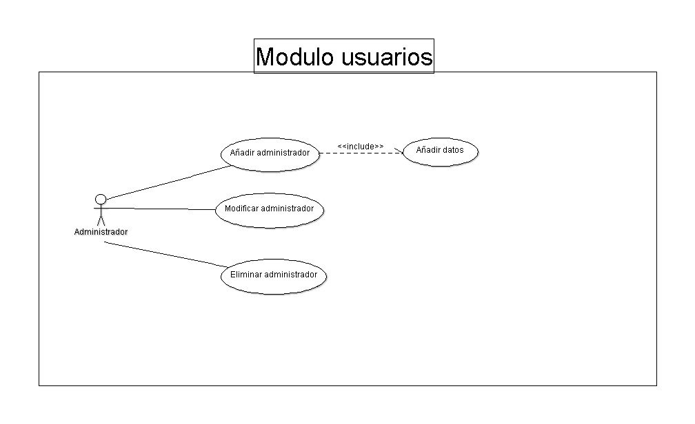

Diseño de la aplicación
*************************

Casos de uso
=================
.. _ref_paginas:

**Caso de uso Modulo Paginas**
-------------------------------
- Este módulo sirve para crear paginas nuevas (Secciones) en las cuales se puede asignar las entradas creadas para introducir contenido nuevo.
.. figure:: CasosDeUso/Paginas.png
   :align: center

.. _ref_multimedia:

**Caso de uso Modulo Multimedia**
-------------------------------
- En este módulo servirá subir al servidor y guardar las imágenes, videos, archivos, documentos. Estas archivos se guardaran en las carpetas específicas. Este módulo solo lo podrá acceder el administrador.

.. _ref_entrada:

**Caso de uso Modulo Entrada**
-------------------------------
- Este módulo las entradas es un tipo de contenido, en donde se pueden agregar fotografías, videos, documentos. Para que funcione tiene que tener asignada una categoría para poder ser asignada a una página. Este módulo solo lo podrá acceder el administrador
.. figure:: CasosDeUso/Entrada.png
   :align: center

.. _ref_estadisticas:

**Caso de uso Modulo Estadisticas**
-----------------------------------
- Aquí el administrador podrá filtrar las estadísticas según sean requeridas.

.. _ref_comentario:

**Caso de uso Modulo Administracion Comentarios**
---------------------------------------------------
- Este modulo el artista podra administrar los comentarios.

.. _ref_eventos:

**Caso de uso Modulo Eventos**
-------------------------------
- En este módulo se crearán los nuevos eventos para ser publicados en el contenido web
.. figure:: CasosDeUso/Eventos.png
   :align: center

.. _ref_artista:

**Caso de uso Modulo Artista**
-------------------------------
- El administrador podrá ingresar a cualquier usuario o artista que quiera ser registrado en la web. Además aquí es donde podrán ser aceptados los nuevos usuarios registrados

.. _ref_usuarios:

**Caso de uso Modulo usarios**
-------------------------------
- En este módulo el administrador podra crear mas perfiles para adminitradores.

Clases
======
- El siguiente diagrama representa una funcionalidad de las posibles clases en el sistema:

Diagrama de BD
===============
- A continuacion esta el diseño de la base de datos:
