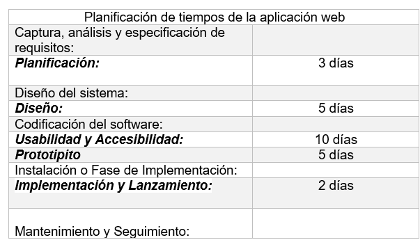

Desarrollo del proyecto
************************

Cómo se trabajará
====================
La metodologia de trabajo sera mediante el modelo UWE, este es un proceso del desarrollo para aplicaciones Web enfocado sobre el diseño sistemático, la personalización y la generación semiautomática de escenarios que guíen el proceso de desarrollo de una aplicación Web. UWE describe una metodología de diseño sistemática, basada en las técnicas de UML, la notación de UML y los mecanismos de extensión de UML. 
Las actividades base de modelado de UWE son el análisis de requerimientos, el modelo conceptual, el modelo navegacional y el modelo de presentación. A estos modelos se pueden sumar otros modelos como lo son el modelo de interacción y la visualización de Escenarios Web.

Actividades a realizar
======================
**1) Captura, análisis y especificación de requisitos:**

En simple palabras y básicamente, durante esta fase, se adquieren, reúnen y especifican las características funcionales y no funcionales que deberá cumplir la aplicación web.

**2) Diseño del sistema:**
Se basa en la especificación de requisitos producido por el análisis de los requerimientos (fase de análisis), el diseño define cómo estos requisitos se cumplirán, la estructura que debe darse a la aplicación web.

**3) Codificación del software:**
Durante esta etapa se realizan las tareas que comúnmente se conocen como programación; que consiste, esencialmente, en llevar a código fuente, en el lenguaje de programación elegido, todo lo diseñado en la fase anterior.

**4) Pruebas:**
Las pruebas se utilizan para asegurar el correcto funcionamiento de secciones de código.

**5) La Instalación o Fase de Implementación:**
Es el proceso por el cual los programas desarrollados son transferidos apropiadamente al computador destino, inicializados, y, eventualmente, configurados; todo ello con el propósito de ser ya utilizados por el usuario final.

Entregables
===========
**- Archivos de aplicacion:** todos los archivos html, php, js, imagenes, que contenga el sitio web.

**- Codigo Fuente:** todas las lineas de codigo impresas para que en un futuro puedan ser modificadas por alguien mas.

**- Manual de usuarios:** este manual contenera toda la explicacion del uso de los modulos.

Tabla de tiempos y costos
==========================

Condiciones
============
- Deben cumplir con los requerimentos minimos de hardware y software para el uso correcto de la aplicacion, estos costos corren por cuenta del cliente.
- Poseer un nombre de dominio y un hosting para el elojamiento web estos costos corren por cuenta del cliente.
- Despues de firmar el contrato de aceptacion, no se podran hacer cambios en el diseño de software, cada cambio tendra un costo extra.

